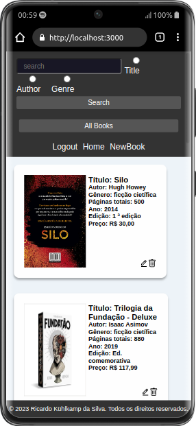
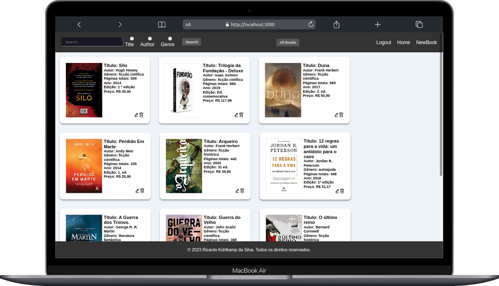

# BookRealm - Aplicação CRUD de Livros
___Projeto Full Stack___ / ___MERN___

Bem-vindo ao LivroRealm, uma aplicação de CRUD (Create, Read, Update, Delete) que permite aos usuários gerenciar livros que eles gostam. Nesta aplicação, os usuários podem adicionar informações sobre livros, incluindo título, autor, descrição, imagem da capa e outras informações relevantes. Eles também podem visualizar, atualizar e excluir os livros que foram adicionados anteriormente.

___MERN___

Este projeto é uma aplicação MERN, ou seja, é um tipo específico de aplicação web que é construída usando um conjunto de tecnologias populares, todas elas começando com as letras M, E, R e N. Essas letras representam quatro componentes principais da aplicação:

- __MongoDB__: É um banco de dados NoSQL orientado a documentos. Ele é usado para armazenar e gerenciar os dados da aplicação. No MongoDB, os dados são armazenados em formato de documentos JSON (BSON, na verdade) e não requerem um esquema rígido como nos bancos de dados SQL tradicionais.

- __Express__: É um framework de aplicativo web para Node.js. Ele simplifica o processo de criação de APIs (interfaces de programação de aplicativos) e manipulação de rotas, gerenciando as requisições e respostas HTTP.

- __React__: É uma biblioteca JavaScript para construir interfaces de usuário. Ela permite criar componentes reutilizáveis que atualizam automaticamente quando os dados mudam, graças ao seu modelo de programação baseado em componentes e à sua abordagem de renderização eficiente.

- __Node.js__: É um ambiente de tempo de execução JavaScript baseado no motor V8 do Google Chrome. Ele permite que você execute código JavaScript no servidor, tornando possível criar aplicativos web completos usando JavaScript tanto no lado do cliente (navegador) quanto no lado do servidor.

Quando combinados, esses quatro componentes formam o acrônimo MERN, representando o fluxo de desenvolvimento completo para a construção de uma aplicação web moderna. Aqui está um breve resumo do processo de construção de uma aplicação MERN:

- Back-End (Servidor):

    - Use o Express para criar rotas e APIs para o aplicativo.
Conecte-se ao MongoDB para armazenar e recuperar dados.

- Front-End (Cliente):

    - Use o React para criar componentes de interface do usuário interativos.
    - Faça solicitações para o servidor usando chamadas de API para obter ou enviar dados.

- Comunicação:

    - O cliente (React) e o servidor (Express) se comunicam através de solicitações HTTP.

- Persistência de Dados:

    - Os dados são armazenados no MongoDB, que é acessado pelo servidor Express.

- Renderização:

    - O React lida com a renderização eficiente dos componentes da interface do usuário no navegador.

- Execução no Servidor:

    - O servidor Node.js (Express) manipula as solicitações do cliente e fornece dados.

- Integração Contínua:

    - A aplicação completa é implantada em um servidor e acessível online.

Em resumo, uma aplicação MERN é uma aplicação web completa que aproveita o MongoDB para o armazenamento de dados, o Express para criar o servidor e APIs, o React para criar a interface do usuário no navegador e o Node.js para executar o código no servidor. Isso resulta em um fluxo de desenvolvimento suave e eficaz para a construção de aplicativos web modernos e dinâmicos.

---

### __Demonstração__

<center>
<div style="background-color: white; display: inline-block; padding: 10px;">
  
  
</div>
</center>

- [___Veja o projeto em ação!___](https://books-realm-app-frontend.vercel.app/) 🎬

> Para o deploy do frontend fora utilizado o [Vercel](https://vercel.com/)

> A api, desenvolvida na pasta backend, está hospedada no [Render](https://render.com/)

---

## Tecnologias Utilizadas
- Backend: O backend da aplicação é desenvolvido em JavaScript e usa a estrutura Express.js para criar uma API RESTful. O banco de dados utilizado é o [MongoDB](https://www.mongodb.com/atlas/database) para armazenar as informações dos livros. Além disso, são utilizadas as seguintes bibliotecas:

  - bcrypt: Usado para encriptar senhas antes de armazená-las no banco de dados, garantindo a segurança dos dados sensíveis.
  - jsonwebtoken: Utilizado para criar e verificar tokens de autenticação, permitindo a proteção das rotas da aplicação e verificação de acesso autorizado.
- Frontend: O frontend é construído em React, uma biblioteca JavaScript popular para a criação de interfaces de usuário interativas. A aplicação utiliza as seguintes bibliotecas:

  - axios: Utilizado para fazer requisições HTTP para o backend e gerenciar as respostas.
  - react-router-dom: Utilizado para gerenciar a navegação entre diferentes páginas/componentes da aplicação.
  - react-icons: Fornece um conjunto de ícones para uso na interface.
  - react-modal: Usado para criar modais interativos na aplicação.
  - react-toastify: Utilizado para exibir mensagens de notificação ao usuário.
  - sass: Usado para escrever estilos CSS de forma mais organizada e eficiente.

---

## Funcionalidades
A BookRealm oferece as seguintes funcionalidades:

- Autenticação e Autorização: A aplicação requer autenticação para acessar suas funcionalidades. Os usuários podem fazer login com suas credenciais existentes ou criar uma nova conta. O uso de tokens JWT e senhas encriptadas garante a segurança das informações e do acesso.

- Adicionar Livro: Os usuários podem adicionar novos livros com informações detalhadas, incluindo título, autor, descrição, imagem da capa e outras informações relevantes.

- Visualizar Livro: Os usuários podem visualizar os detalhes de um livro específico, incluindo todas as informações fornecidas durante a adição.

- Atualizar Livro: Os usuários têm a opção de editar as informações de um livro existente, como título, autor, descrição e imagem da capa.

- Excluir Livro: Os usuários podem excluir um livro da lista.

---

## Instalação e Uso

Siga estas etapas para instalar e executar o projeto:

1.  Clone o repositório:
```
git clone git@github.com:ricardokuhlkamp/books-real-app.git
cd books-real-app
```
2.  Configurar o Backend:

Navegue até a pasta backend:
```
cd app/backend
```
- Instale as dependências:
```
npm install
```
- Crie um arquivo .env na pasta backend e configure as variáveis de ambiente necessárias, como as configurações do banco de dados MongoDB e a chave secreta do JWT.

3.  Iniciar o Backend:
- Execute o seguinte comando para iniciar o servidor backend em modo de desenvolvimento:
```
npm run dev
```
4.  Configurar o Frontend:

Navegue até a pasta frontend:
```
cd app/frontend
```
- Instale as dependências:
```
npm install
```
5.  Iniciar o Frontend:
- Execute o seguinte comando para iniciar o servidor de desenvolvimento do React:
```
npm start
```
6.  Acessar a Aplicação:
- Abra seu navegador e acesse a aplicação em: http://localhost:3000.

---

## Observações
Certifique-se de que o backend esteja em execução antes de iniciar o frontend, pois o frontend depende das APIs fornecidas pelo backend para funcionar corretamente.

Lembre-se também de atualizar as URLs das variáveis de ambiente de acordo com o ambiente em que o projeto está sendo executado (desenvolvimento, produção, etc.).

---

## Contato
Se tiver alguma dúvida ou sugestão, sinta-se à vontade para entrar em contato comigo:

E-mail: <ric.kds@hotmail.com>

GitHub: [github.com/ricardokuhlkamp](https://github.com/ricardokuhlkamp)

Linkedin: [www.linkedin.com/in/ricardo-kühlkamp-dev](www.linkedin.com/in/ricardo-kühlkamp-dev)


